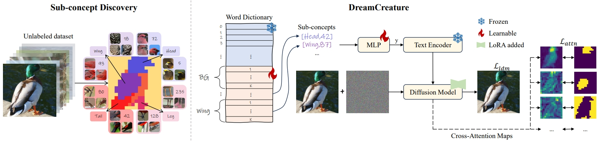
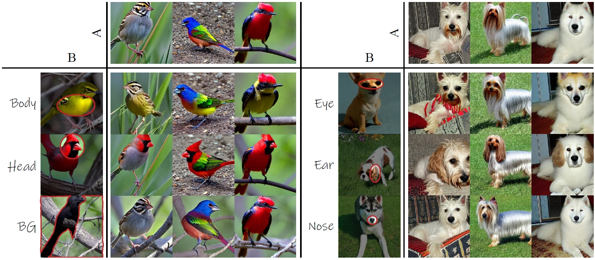

<div align="center">
  
# PartCraft: Crafting Creative Objects by Parts (ECCV 2024)

<a href="https://pytorch.org/get-started/locally/"></a>
[](https://arxiv.org/abs/2311.15477)
[](https://badges.toozhao.com/badges/01HG2ZDZV8WJ73GSR6PXBXAZ56 "Get your own page views count badge on badges.toozhao.com")
[](https://huggingface.co/spaces/kamwoh/dreamcreature)
[](https://colab.research.google.com/github/kamwoh/dreamcreature/blob/master/dreamcreature_gradio.ipynb)

</div>


**Abstract**: Recent text-to-image (T2I) generative models allow for high-quality synthesis following either text
instructions or visual examples. Despite their capabilities, these models face limitations in creating new, detailed
creatures within specific categories (e.g., virtual dog or bird species), which are valuable in digital asset creation
and biodiversity analysis.
To bridge this gap, we introduce a novel task, **Virtual Creatures Generation**: Given a set of unlabeled images of the
target concepts (e.g., 200 bird species), we aim to train a T2I model capable of creating new, hybrid concepts within
diverse backgrounds and contexts.
We propose a new method called **DreamCreature**, which identifies and extracts the underlying sub-concepts (e.g., body
parts of a specific species) in an unsupervised manner. The T2I thus adapts to generate novel concepts (e.g., new bird
species) with faithful structures and photorealistic appearance by seamlessly and flexibly composing learned
sub-concepts. To enhance sub-concept fidelity and disentanglement, we extend the textual inversion technique by
incorporating an additional projector and tailored attention loss regularization. Extensive experiments on two
fine-grained image benchmarks demonstrate the superiority of DreamCreature over prior art alternatives in both
qualitative and quantitative evaluation. Ultimately, the learned sub-concepts facilitate diverse creative applications,
including innovative consumer product designs and nuanced property modifications.


### Methodology



Overview of our DreamCreature. (Left) Discovering sub-concepts within a semantic hierarchy involves partitioning each
image
into distinct parts and forming semantic clusters across unlabeled training data. (Right) These clusters are organized
into a dictionary,
and their semantic embeddings are learned through a textual inversion approach. For instance, a text description
like `a photo of a
[Head,42] [Wing,87]...` guides the optimization of the corresponding textual embedding by reconstructing the associated
image. To
promote disentanglement among learned concepts, we minimize a specially designed attention loss, denoted as
$\mathcal{L}_{attn}$.

### Mixing sub-concepts



Integrating a specific sub-concept (e.g., body, head, or even background) of a source concept B to the target concept A.

### Our results

Mixing 4 different species:


More examples;


Creative generation:


### Usage

1. A demo is available on
   the [`kamwoh/dreamcreature` Hugging Face Space](https://huggingface.co/spaces/kamwoh/dreamcreature). (Very very slow
   due to CPU only)
2. You can run the demo on a
   Colab: [](https://colab.research.google.com/github/kamwoh/dreamcreature/blob/master/dreamcreature_gradio.ipynb).
3. You can use the gradio demo locally by running `python app.py` or `gradio_demo_cub200.py` or `gradio_demo_dog.py` in
   the `src` folder.

### Training

1. Check out `train_kmeans_segmentation.ipynb` to obtain a DINO-based KMeans Segmentation that can obtain the "parts"/"
   sub-concepts". This is to obtain the "attention mask" used during the training.
2. Assuming no labels, we can also use the kmeans labels as a supervision, otherwise we can use the supervised labels (
   such as ground-truth class) as we can obtain higher quality of reconstruction.
3. Check out `run_sd_sup.sh` or `run_sd_unsup.sh` for training. All hyperparameters in these scripts are used in the
   paper.
4. SDXL version also available (see `run_sdxl_sup.sh`) but due to resource limitation, we cannot efficiently train a
   model, hence we do not have a pre-trained model on SDXL.

### Notes

1. The original paper title was: `DreamCreature: Crafting Photorealistic Virtual Creatures from Imagination`

### Citation

```
@inproceedings{
  ng2024partcraft,
  title={PartCraft: Crafting Creative Objects by Parts},
  author={Kam Woh Ng and Xiatian Zhu and Yi-Zhe Song and Tao Xiang},
  booktitle=ECCV,
  year={2024}
}
```
