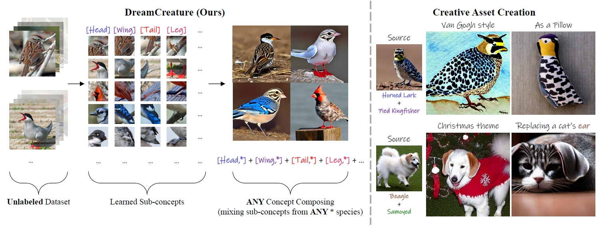
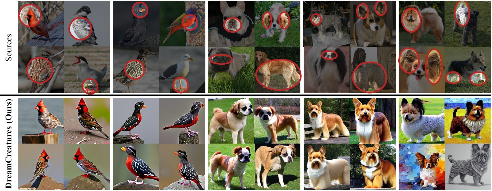

  
# DreamCreature: Crafting Photorealistic Virtual Creatures from Imagination

**Abstract**: Recent text-to-image (T2I) generative models allow for high-quality synthesis following either text instructions or visual examples. Despite their capabilities, these models face limitations in creating new, detailed creatures within specific categories (e.g., virtual dog or bird species), which are valuable in digital asset creation and biodiversity analysis. 
To bridge this gap, we introduce a novel task, **Virtual Creatures Generation**: Given a set of unlabeled images of the target concepts (e.g., 200 bird species), we aim to train a T2I model capable of creating new, hybrid concepts within diverse backgrounds and contexts.
We propose a new method called **DreamCreature**, which identifies and extracts the underlying sub-concepts (e.g., body parts of a specific species) in an unsupervised manner. The T2I thus adapts to generate novel concepts (e.g., new bird species) with faithful structures and photorealistic appearance by seamlessly and flexibly composing learned sub-concepts. To enhance sub-concept fidelity and disentanglement, we extend the textual inversion technique by incorporating an additional projector and tailored attention loss regularization. Extensive experiments on two fine-grained image benchmarks demonstrate the superiority of DreamCreature over prior art alternatives in both qualitative and quantitative evaluation. Ultimately, the learned sub-concepts facilitate diverse creative applications, including innovative consumer product designs and nuanced property modifications.

### Notes
We are working on releasing the code... 🏗️ 🚧 🔨 Please stay tuned!
